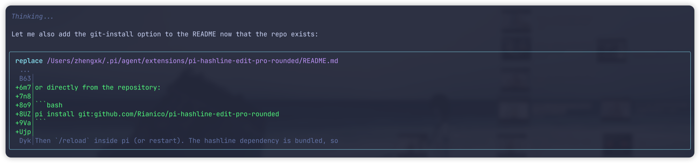

# pi-hashline-edit-pro-rounded

Rounded-corner frames (`╭ ╮ ╰ ╯ ─ │`) around Pi's tool call/result blocks,
with **pi-hashline-edit-pro embedded** so its hash-anchored tools get frames
too — no forking or modifying hashline.



## Acknowledgments

Big thanks to [YuGiMob](https://github.com/YuGiMob) for
[pi-hashline-edit-pro](https://github.com/YuGiMob/pi-hashline-edit-pro) — the
perfect hashing engine, the strict hash-anchored `replace`, the undo store,
and the auto-read hook that make this package useful in the first place. This
extension embeds hashline's own code unchanged (no fork) and only adds frames
around it.

## What it does

- **Embeds [pi-hashline-edit-pro](https://github.com/YuGiMob/pi-hashline-edit-pro)**:
  runs hashline's own factory through a capturing proxy and re-registers every
  tool it registers — `read`, `replace`, `undo_last_replace` — wrapped in
  rounded frames. Hash anchors, strict replace with preview + undo store, the
  auto-read hook, and `toggle-auto-read` all keep working untouched.
- **Frames the seven built-ins** (`read`, `write`, `edit`, `bash`, `grep`,
  `find`, `ls`), with the border color tracking tool state
  (pending → warning, error → error, success → border).
- **Conflict-safe**: names owned by another extension are left alone
  (unless you `force` or `aliases` them).

## Install

```bash
pi install npm:pi-hashline-edit-pro-rounded
```

or directly from the repository:

```bash
pi install git:github.com/Rianico/pi-hashline-edit-pro-rounded
```

Then `/reload` inside pi. If you previously installed pi-hashline-edit-pro as a
standalone extension, remove it so the embedded wrapped version wins
deterministically:

```bash
pi remove npm:pi-hashline-edit-pro
```

## Configuration

Defaults are overridable via the `PI_ROUNDED_TOOLS` environment variable
(JSON, deep-merged):

```bash
PI_ROUNDED_TOOLS='{"tools":["bash","grep","ls"],"corners":"straight"}' pi
```

| Option | Default | Meaning |
|---|---|---|
| `tools` | all 7 built-ins | Built-in names to wrap. Unknown names are skipped with a log. |
| `force` | `[]` | Extension-owned names to **replace** with a fresh built-in + frames. |
| `aliases` | `{}` | Rename a wrapped registration, e.g. `{"read":"read2"}`. |
| `hashline` | `true` | Embed pi-hashline-edit-pro and wrap all of its tools in frames. |
| `corners` | `"rounded"` | `"rounded"` (`╭╮╰╯`) or `"straight"` (`┌┐└┘`). |
| `padding` | `1` | Inner horizontal padding columns. |
| `stackCallResult` | `true` | Call + result merge into one continuous frame. |
| `skipPartial` | `true` | No frame while streaming (avoids flicker). |
| `minWidth` | `4` | Below this width, render inner content unframed. |
| `colors` | pending `warning`, error `error`, success `border` | Border color keys per tool state via `theme.fg()`. |
| `log` | `true` | Log skip / force decisions. |

## Development

Vitest suite + `tsc --noEmit` typecheck. See the
[repository](https://github.com/Rianico/pi-hashline-edit-pro-rounded) for
tests, structure, and coverage requirements.

## Uninstall

```bash
pi remove npm:pi-hashline-edit-pro-rounded
```
